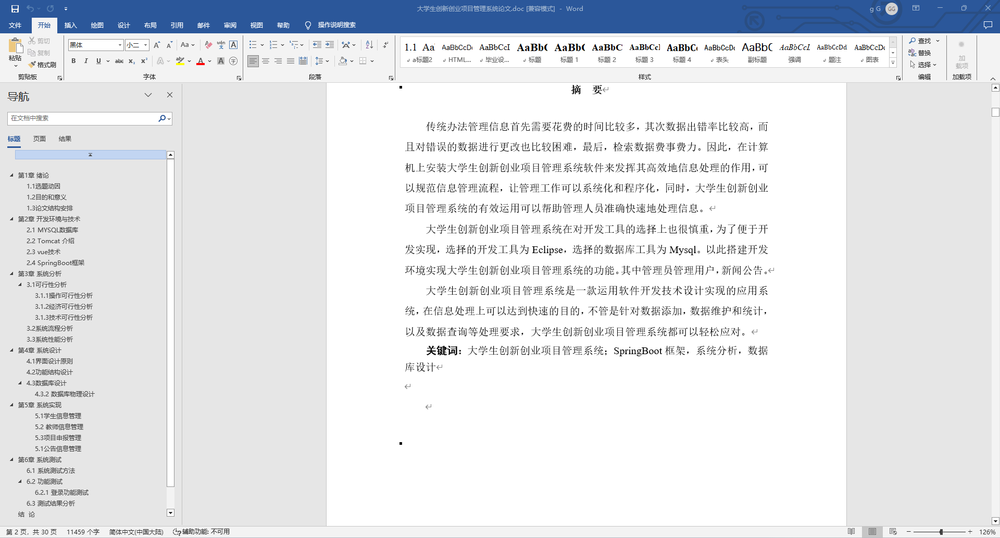
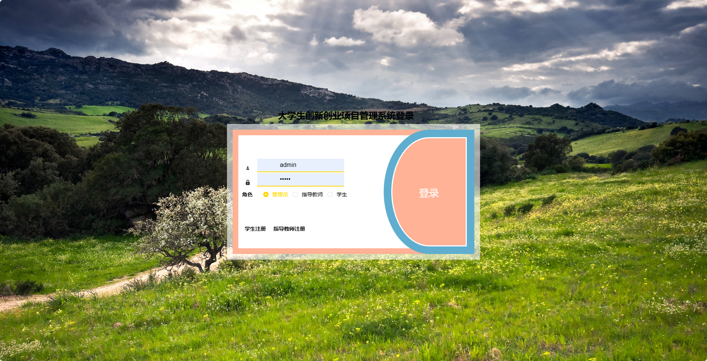
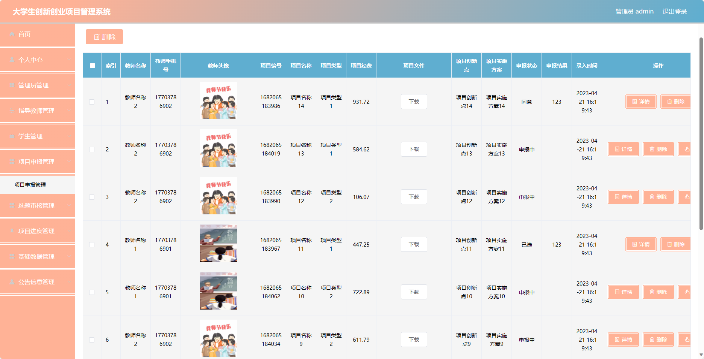
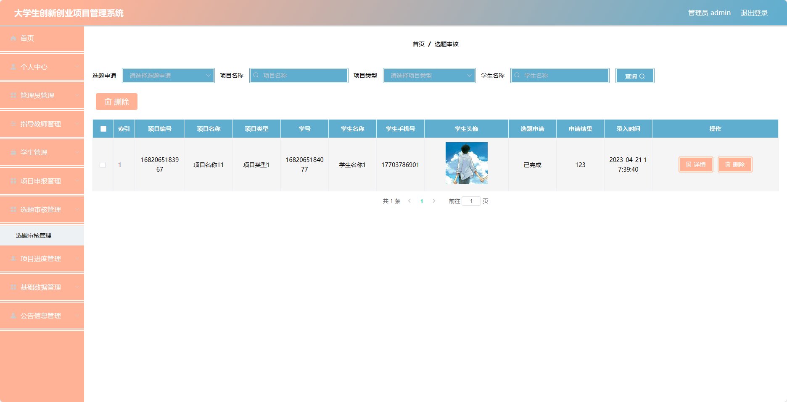
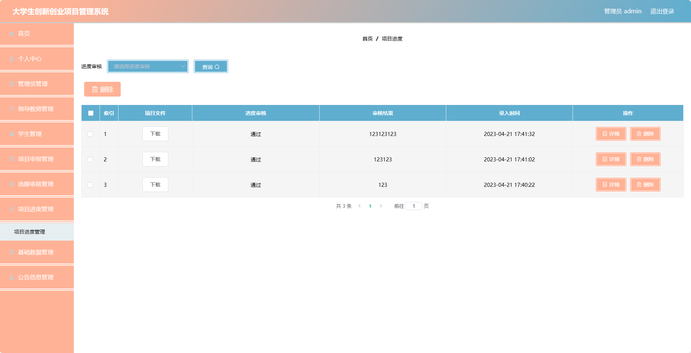
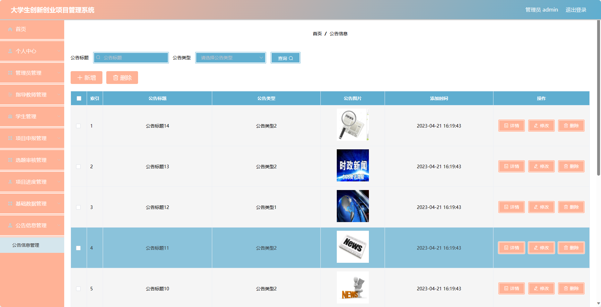
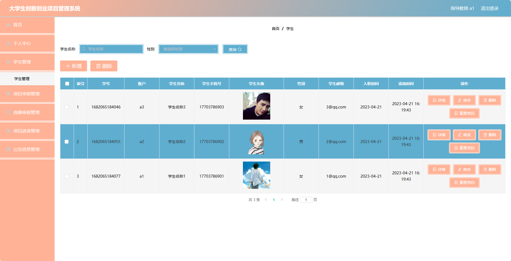
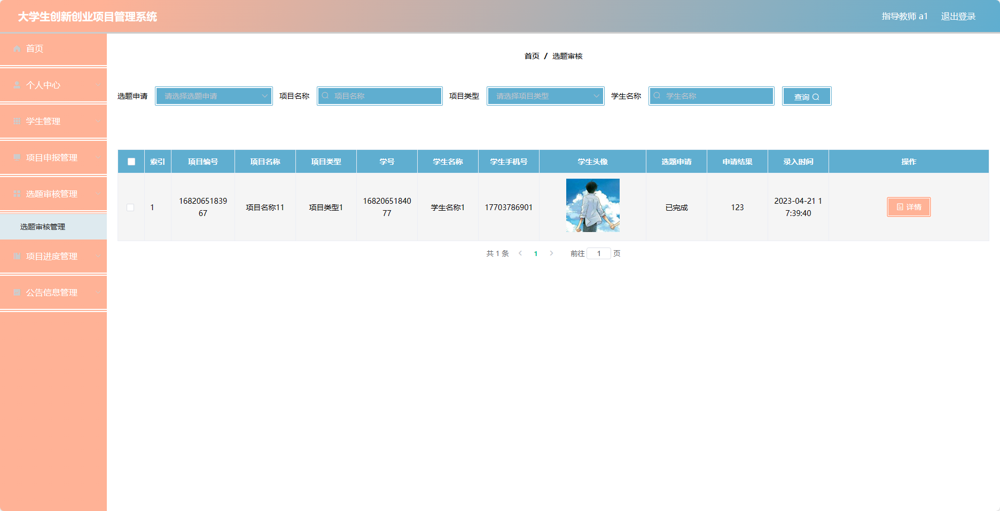
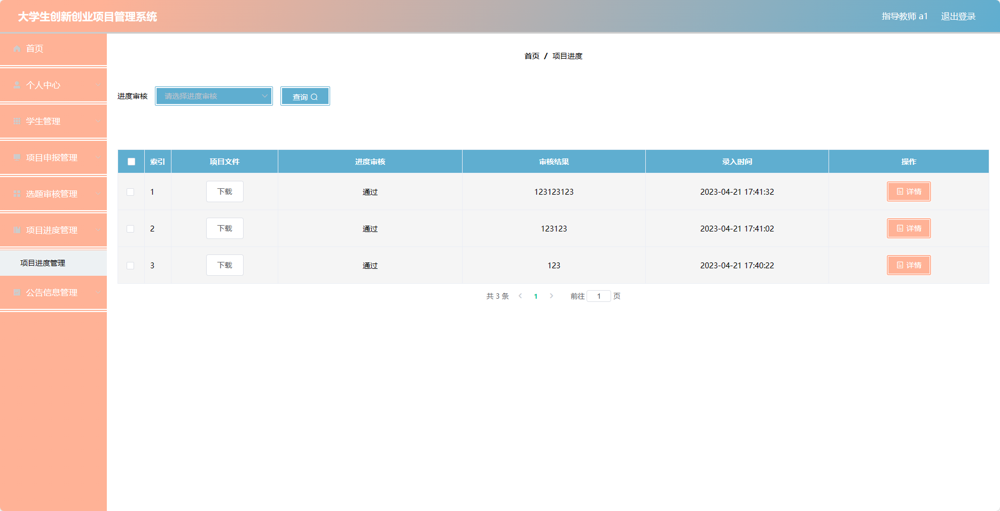
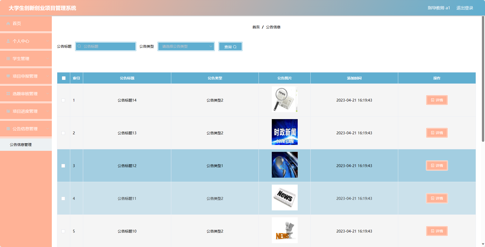

## 基于SpringBoot的大学生创新创业项目管理系统(程序+报告)

- <b>完整代码获取地址：从戎源码网 ([https://armycodes.com/](https://armycodes.com/))</b>
- <b>技术探讨、资料分享，请加QQ群：692619798</b> 
- <b>作者微信：19941326836  QQ：952045282</b> 
- <b>承接计算机毕业设计、Java毕业设计、Python毕业设计、深度学习、机器学习</b>
- <b>选题+开题报告+任务书+程序定制+安装调试+论文+答辩ppt 一条龙服务</b>
- <b>所有选题地址 ([https://github.com/YuLin-Coder/AllProjectCatalog](https://github.com/YuLin-Coder/AllProjectCatalog)) </b>

## 项目介绍
基于SpringBoot的大学生创新创业项目管理系统，系统包含三种角色：管理员、指导教师、用户,系统分为前台和后台两大模块，主要功能如下

### 【管理员】:
- 个人中心：管理个人信息和账户。
- 管理员管理：管理系统中的管理员信息。
- 指导教师管理：管理系统中的指导教师信息。
- 学生管理：管理系统中的学生信息。
- 项目申报管理：查看和管理所有的创新创业项目申报信息。
- 选题审核管理：对创新创业项目选题进行审核和审批。
- 项目进度管理：查看和管理所有创新创业项目的进展情况。
- 基础数据管理：管理系统中的基础数据信息。
- 公告信息管理：发布和管理系统中的公告信息。
- 系统管理：修改个人密码和其他系统设置。

### 【指导老师】:
- 个人中心：管理个人信息和账户。
- 学生管理：管理所指导的学生信息。
- 项目申报管理：查看和管理所指导的创新创业项目申报信息。
- 选题审核管理：对所指导的创新创业项目选题进行审核和审批。
- 项目进度管理：查看和管理所指导的创新创业项目的进展情况。
- 公告信息管理：查看系统发布的公告信息。
- 系统管理：修改个人密码和其他系统设置。

### 【学生】:
- 个人中心：管理个人信息和账户。
- 项目申报管理：提交创新创业项目的申报。
- 选题审核管理：查看和管理创新创业项目选题审核情况。
- 项目进度管理：查看和管理参与的创新创业项目的进展情况。
- 公告信息管理：查看系统发布的公告信息。
- 系统管理：修改个人密码和其他系统设置。

## 项目技术
- 编程语言：Java
- 数据库：MySQL
- 项目管理工具：Maven
- 前端技术：HTML、CSS、JavaScript、Jquery、Vue
- 后端技术：Spring、SpringMVC、MyBatis

## 运行环境
- JDK版本：JDK1.8及以上
- 开发工具：IDEA、Ecplise、Myecplise都可以
- 数据库: MySQL5.7及以上
- Maven：maven3.0及以上
- Node：14.14.0及以上

## 运行截图

